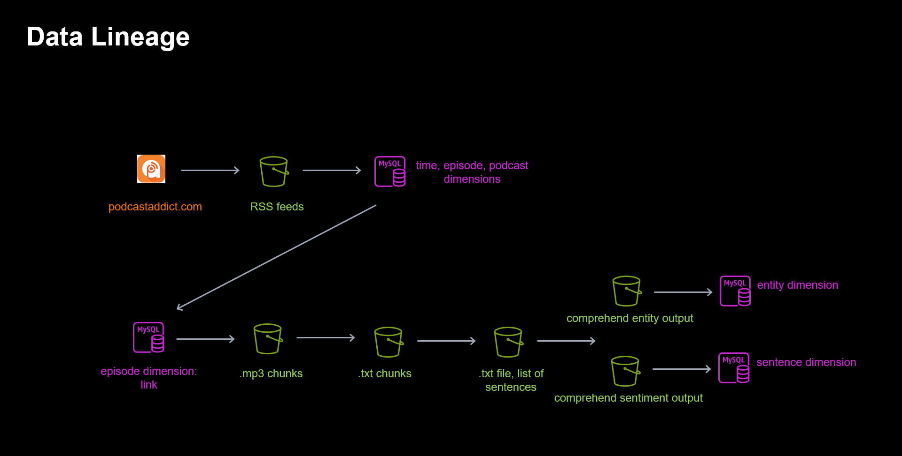

# Serverless Podcast ETL
## Project Summary
In this project, we create a serverless podcast ETL using AWS Lambda functions. This project contains two distinct processes, each of which begin with a message sent to an SQS Queue:

- Messages sent to one queue trigger a Lambda function scrape the web for rss feeds. Extracted feeds are stored in an S3 bucket, which triggers another Lambda function to "tranform load" podcast and episode metadata into an RDS database.
  - The message sent to this queue corresponds to a search on [Podcast Addict](podcastaddict.com). For instance, messaging "The Ringer" to this queue would download RSS feeds and store metadata for the top 10 results of searching "The Ringer" on Podcast Addict.

- Messages sent to another queue trigger a process, made up of multiple lambda functions, which downloads podcasts using the data stored in the previous step,  transcribes the downloaded podcast into text using an asynchronous AWS Transcribe job, performs asynchronous NLP tasks on the transcribed text using AWS Comprehend, and then loads the resulting data into an RDS database. 
  - The message sent to this queue corresponds to the title of the podcast whose most recent, undownloaded episode you would like to download. 

This project also generates an EC2 instance with an interactive [Dash](https://dash.plotly.com/) dashboard which displays our podcast data in an intuitive way.
- This app is open only to TCP traffic on ports 22 (for ssh and app initialization purposes) and 8050 (for viewing the dash app).
- As the RDS database is secured in a private subnet, the EC2 instance serves as a bastion host of sorts. 

The infastructure of this project is described by the following diagram. 

- Python is used to implement each AWS Lambda function 
- Terraform IAC is used to provision the entire infastructure of this project

## Dashboard Visualization
Here is a brief video demonstrating the resulting dashboard:

<video src="./photos/dash-demo-smaller.mp4" controls="controls" style="max-width: 730px;">
</video>

This video may not show in Github. If you clone this repo and view this file, it should show. Alternatively, check out these screenshots:

While the dashboard created in this project could be viewed by anyone on through a public dns of the EC2 instances, for monetary and free-tier usage purposes, I have terminated these resources.  To create your own dashboard, __please view the Reproducibility section__ and follow the simple steps. 

## Data Warehousing Choices
The database created in this project has the snowflake schema shown below:

Here, our facts table consists of every instance of a detected entity, as well as information determining which sentence this mention came from. The various dimensions give information regarding sentences, episodes, podcasts, and time. Please note the nested one-to-many relationships typical in a snowflake schema. This schema is a natural choice due to the nested inclusion relationship between words, sentences, podcast episodes, and podcasts. Since the finest resolution for which sentiment can be accurately inferred by machine learning models is on the level of sentences, we choose to store sentiment in this dimension. 

## Fast Podcast Transcription using Serverless Map Reduce
Lambda functions indicated by 3,4, and 5 on the original diagram make up a serverless MapReduce framework for podcast transcriptions. In particular, 
- Lambda function 3 uploads a series of 10 minute chunks to an S3 file
- Lambda function 4 triggers FOR EACH 10 minute chunk. I.e., for a single podcast download, this Lambda function is triggered many times. Each invocation triggers an asynchronous AWS Comprehend job.
- Lambda function 5 waits until all transcriptions are finished, then combines to a single transcription. This lambda function makes up the reduce step.

Since AWS Transcribes performs the tasks for each 10 minute chunk in parallel, the time to transcribe an entire podcast is reduced dramatically. This process is pictorally represented in the following diagram:

## Staging Areas and Data Lineage
Intermediate storage throughout the pipeline is acheived through a number of S3 buckets. These staging areas allow for the data to be inspected throughout its lifecycle. I.e., if data quality is found to be poor in the data warehouse, each staging step can be inspected to see presicely where the issue is occuring. The data lineage is visualized in the following diagram.

## Reproducibility

### Prerequisites
 - An aws account with properly configured credentials
 - Terraform installed locally on your machine

### Instructions

- Run `./init.sh`
  - You may need to run `chmod +x init.sh` to ensure this file has proper permissions.
  - This file locally installs layers for our lambda functions, and sets up some directories used by terraform.

- Run `terraform init` followed by `terraform apply`
  - This will provision our entire infastructure using terraform.
  - It creates over 75 resources in aws, so it may take a moment.

- Send a SQS message to trigger the first lambda function: `cd SQS_scripts && chmod +x *.sh && ./scrape.sh "The Ringer"`
   - This will scrape rss feeds from [Podcast Addict](https://podcastaddict.com/) corresponding to the first 10 results of typing "The Ringer" into the search bar.
   - Feel free to play around with the message in quotes to scrape your favorite podcasts!

- Download the most recent (undownloaded) episode of any of the previous scraped podcasts:
`./download.sh "The Ringer NFL Show"`
   - A CloudWatchLog stream corresponding to your third lambda function will tell you your available options.
   - Alternatively, the dashboard tells you the name of each podcast ready for downloading.
   - This will trigger both transcriptions and some aws comprehend jobs. The latter may take a few minutes to complete before the sentence and entity dimensions are populated.

- Run `./ssh.sh`, answering yes when prompted, to ssh into your ec2 instance
- Once there, initialize the instance by running `cd ec2_data && chmod +x bootstrap.sh && ./bootstrap.sh`
- Finally, start dash server by running `python3 app.py`
  - The app can be viewed on address found at the bottom, commented-out line of the __ssh.sh__ file. 

### Cleanup
- Run `terraform destroy`
  - terraform will not destroy the 6 staging buckets created throughout this process. I suggest removing this from the commandline using the `--force` parameter of the `aws s3 rb` command. 